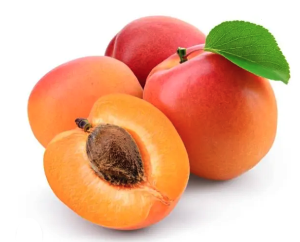
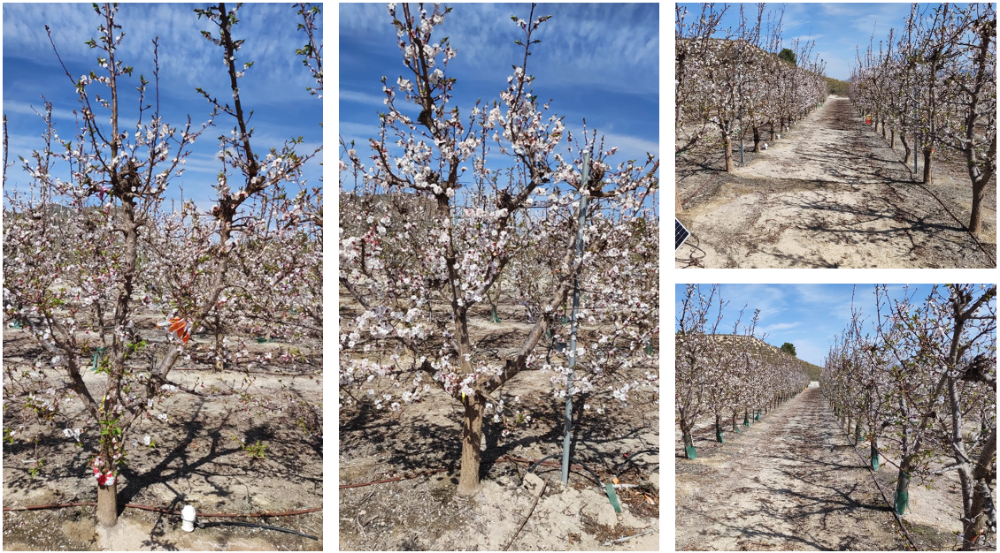
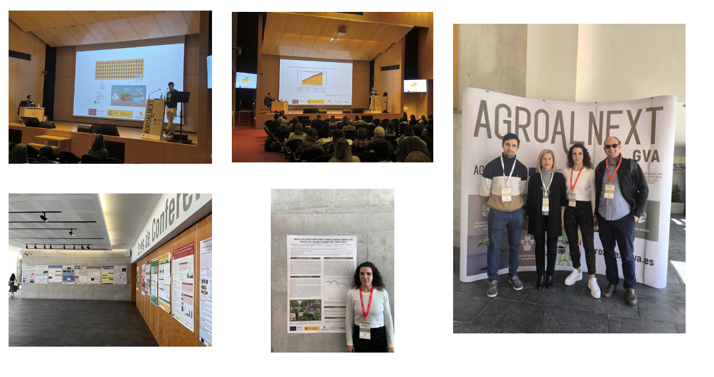
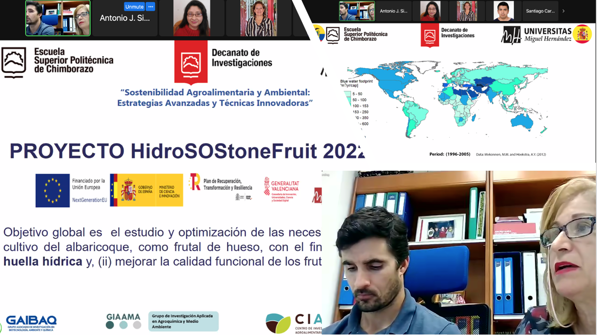
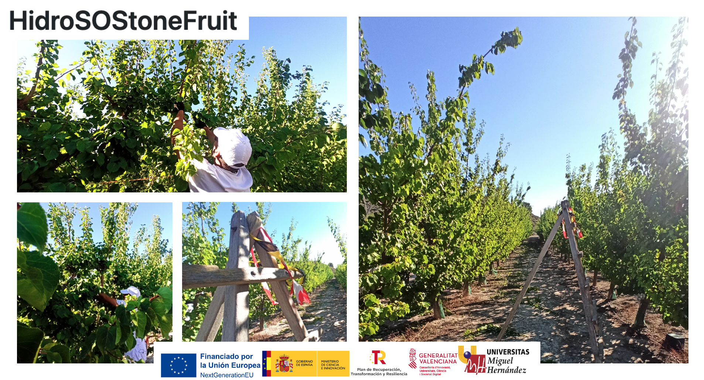
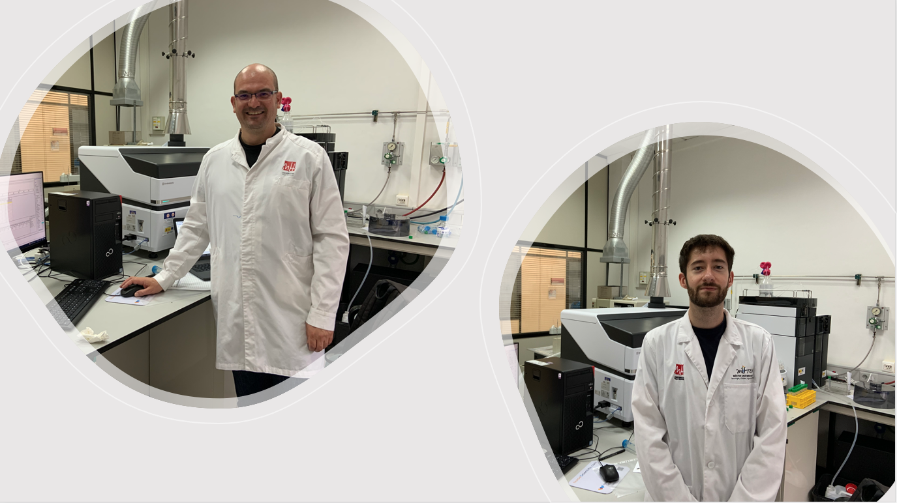
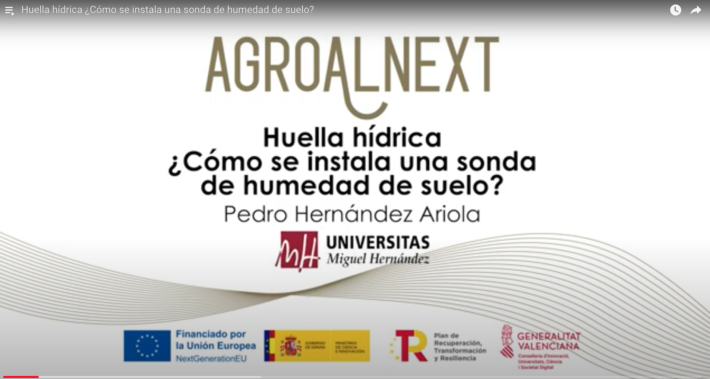

# HidroSOStoneFruit

# **Estrategias hidroSOStenibles en frutales de hueso: Caso a estudio el albaricoquero (HidroSOStoneFruit)** 

> **Investigadores**: [Francisca Hernández García](https://www.umh.es/contenido/pas/:persona_4146/datos_es.html), [Esther Sendra Nadal](https://www.umh.es/contenido/Estudios/:persona_4100/datos_es.html), [Francisco Miguel Burló Carbonell](https://www.umh.es/contenido/Estudios/:persona_5298/datos_es.html), [Rafael Martínez Font](https://www.umh.es/contenido/PDI/:persona_5485/datos_es.html), [David Bernardo López Lluch](https://www.umh.es/contenido/pas/:persona_5401/datos_es.html), [Antonio José Signes Pastor](https://www.umh.es/contenido/Estudios/:persona_120071/datos_es.html?clase=:PI), [Luis Noguera Artiaga](https://www.umh.es/contenido/Investigacion/:persona_163965/datos_es.html), Lucia Andreu Coll, Jesús García Brunton y Alejandro Galindo Egea.

**Resumen:**

El  objetivo global de esta expresión de interés se centra en el estudio y  optimización de las necesidades hídricas del cultivo del albaricoque, como  frutal de hueso, con el fin de: (i) reducir la huella hídrica y, (ii) mejorar  la calidad funcional de los frutos. Una gestión sostenible de los recursos  naturales tales como el agua agrícola es un reto actual. Es esperable que la  restricción hídrica aplicada al cultivo del albaricoque durante periodos  fenológicos clave desencadene la generación de metabolitos secundarios como  respuesta al estrés fomentando las propiedades funcionales del fruto. La  evidencia generada permitirá un avance significativo para la obtención de  frutos de hueso más sanos y saludables producidos en un entorno  hidroSoStenible con creciente demanda de mercado.

 

**Fecha de inicio**: 01 de septiembre de 2022. **Fecha fin**: 29 de junio de 2025.

* *1er año*: 01 de septiembre 2022 al 31 agosto 2023. 
* *2º año*: 01 de septiembre 2023 al 31 agosto 2024. 
* *3er año*: 01 septiembre 2024 al 29 junio 2025.

 

---

 

**La parcela experimental del proyecto @HidroSOStoneFruit está en floración. ¡Fotos espectaculares! **

**10 Marzo 2024** 

 

---

 

**Representantes del proyecto HidroSOStenibles participan en el congreso AGROALNEXT de 6-8 de marzo celebrado en Gandía **

**6-8 Marzo 2024** 

 

---

 

**I WORKSHOP: ESTRATEGIAS HIDROSOSTENIBLES EN FRUTALES DE HUESO. 11 enero 2024 9:00 – 12:00 Salón de actos de la EPSO (UMH)** 

**11 Enero 2024**

 

---

 

**Anuncio:  I WORKSHOP: ESTRATEGIAS HIDROSOSTENIBLES EN FRUTALES DE HUESO. 11 enero 2024 9:00 – 12:00 Salón de actos de la EPSO (UMH)** 

**20 Diciembre 2023**

 

---

 

**Participación en Congreso Internacional organizado por la Escula Superior Politécnica de Chimborazo, Ecuador** 

**15 Noviembre 2023**

La Dra. Francisca Hernández y el Dr. Alejandro Galindo presentaron una ponencia titulada "Estrategias de riego HidroSOStenibles en frutales de hueso" en el Webinar Internacional "Sostenibilidad Agroalimentaria y Ambiental: Estrategias Avanzadas y Técnicas Innovadoras”. Este evento fue organizado por la Escuela Superior Politécnica de Chimborazo, a través del Decanato de Investigaciones y el Grupo Asociado de Investigación en Biotecnología, Ambiente y Química (GAIBAQ) de la Facultad de Ciencias de Ecuador.

 

---

 

**Reunión seguimiento proyecto** 

**15 Septiembre 2023**

 

---

 

**Poda de los albaricoqueros** 

**17 Agosto 2023**

 

---

 

**Análisis de contenido de elementos minerales en muestras de albaricoque** 

**05 Julio 2023**

 

---

 

**Huella hídrica ¿Cómo se instala una sonda de humedad de suelo?** 

**04 Julio 2023**

[Huella hídrica ¿Cómo se instala una sonda de humedad de suelo?](https://www.youtube.com/watch?v=uKKxtsho8IE&list=PLClKgnzRFYe6sCogMRFFPCBc_cqVeoe2K&index=2)

 

---

 

**Análisis sensorial de los albaricoques** 

**16 Mayo 2023**

 

---

 

**Evaluación de la fruta** 

**15 Mayo 2023**

 

---

 

**Recoleción de los melocotones** 

**12 Mayo 2023**

 

---

 

**1º WORKSHOP AGROALNEXT GENERALITAT VALENCIANA SOBRE PRODUCCIÓN PRIMARIA SOSTENIBLE Y TRANSICIÓN ECOLÓGICA** 

**04 Mayo 2023**

[Programa](https://drive.google.com/file/d/16dKxWffwhmC3MTF5YryCTGMZxVaPUP25/view?usp=share_link)

[Video presentación "Estrategias HidroSOStenibles en frutales de hueso: Caso a estudio el albaricoque" ](https://www.youtube.com/watch?v=k209ILBVzlQ&list=PLClKgnzRFYe4aSBzNN3_WPfsPAIlW5iBg&index=7)

 

---

 

**Visita campo** 

**19 Abril 2023**

 

---

 

**Reunión investigadores del proyecto** 

**02 Marzo 2023**

 

---

 

**Fotos de campo** 

**13 Enero 2023**

Detalles frontales y filas de los arboles a los que se tomarán medidas de campo.

 

---

 

**Fotos de campo** 

**5/29 Diciembre 2022**

A) Fila de árboles; B) Inserción de tapón; C) Barrillo tubo

 

---

 

**AGROALNEXT: Plan complementario de Agroalimentación - Presentación programa** 

**24 Octubre 2022**

[Descargar presentación](https://drive.google.com/file/d/1ZcYdupeW4l7V0tbv4lo0LQ9YpzzTeBTP/view?usp=share_link)

 

---

 

> **Documentación de interés:**
>
> [Reglamentos](https://drive.google.com/drive/folders/1l3JqbgNMCD1mjzWLBqguUnrIbWdYx2jE?usp=share_link)
>
> [Protocolos](https://drive.google.com/drive/folders/1ftZEp6jxbXLOot7EKRq1S6zH1HbFb6Ib?usp=share_link)
>
> [Referencias](https://drive.google.com/drive/folders/1fjS2W2lkOj3U3x5BxrPuMxb7fs-nFSS-?usp=share_link)
>
> [Propuestas TFM](https://drive.google.com/file/d/1rXseRmuWKenAofi0v2qE_qwYkbINVkvu/view?usp=share_link)
>
> [Agradecimientos](https://drive.google.com/file/d/1u8ZiokyU7YGBqFYsj6mZOvPZUL5kvQgW/view?usp=share_link)
>
> [Indicadores](https://drive.google.com/drive/folders/1qNdLvMNeX8Q6Xf-Tbb9YdibZUUtcCXiD?usp=share_link)
